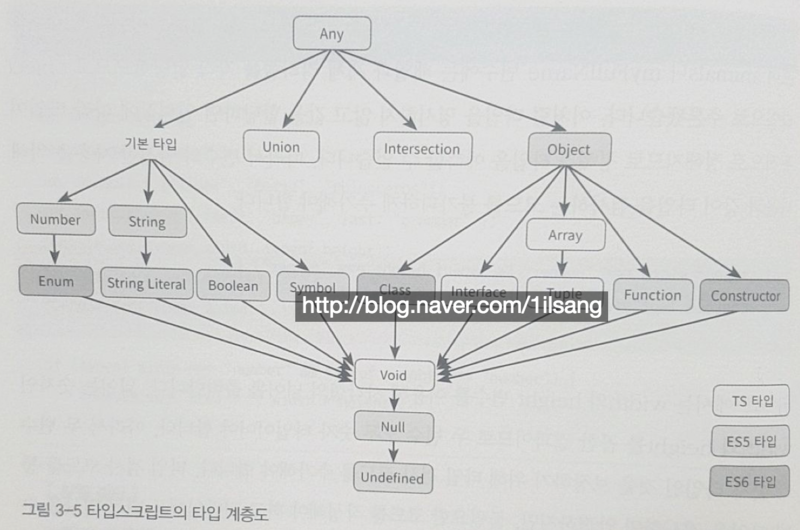

# Typescript Quick Start

## 03 _ 변수 선언과 기본 타입

### 3.1. 변수 선언

####  3.1.1. var 선언자 특징

- 호이스팅

```typescript
helloMessage = "hello";
console.log(helloMessage);

var helloMessage;
```

- 함수 레벨 스코프(function level scope)  <> 블록레벨 스코프(block level scope)

```typescript
var myName = "sad";

if(true){
    var myName = "happy";
}

console.log(myName); // "happy" 출력
```


블록 레벨 스코프를 지원하는 대표적인 선언

- let, const
- class, interface, type alias, enum


#### 3.1.2. let 선언자 특징

- 같은 블록 내에서 같은 이름의 변수를 중복해서 선언할 수 없음

```typescript
let myName2;
let myName2; // Error
```

- 변수를 초기화하기 전에는 변수에 접근할 수 없게 해서 호이스팅을 방지

```typescript
console.log(myName2); // Error, 변수를 초기화하기 전에 변수에 접근 불가
let myName2 = "happy";
```

- 선언할 변수에 블록레벨 스코프를 적용

```typescript
{ 
    // A scope
    { 
        // B scope
        { 
            // C scope
        }
    }
}
```


#### 3.1.3. 상수 선언

`const`

- 블록 레벨 스코프 지원
- 호이스팅 일으키지 않음
- 변수를 상수로 선언할 때 사용
- 선언할 때 초기화는 가능하지만 재할당 불가 (read only)


```typescript
const profile = {
    name:"happy",
    month: birthMonth
}

profile = {
    name: "happygrammer",
    month: 1
} // Error 재할당 불가

profile.name = "happy1"; // 할당 가능
profile.name = "happy2"; // 할당 가능
profile.month--; // 할당 가능
```

예외적으로 const로 선언한 변수라도 객체 리터럴의 속성으로는 변경할 수 있다.

값 자체를 재할당 하는 것은 허용하지 않지만, 속성값의 변경을 허용하는 특성


### 3.2. 타입 검사와 타입 선언

#### 3.2.1. 점진적 타입 검사

1. 정적 타입 검사(statically type checking) : 자바, C++
2. 동적 타입 검사(dynamically type checking) : 자바스크립트
3. 점진적 타입 검사(gradually type checking) : 타입스크립트, 파이썬


##### 점진적 타입 검사

- 컴파일 시간에 타입 검사를 수행하면서 필요에 따라 타입 선언의 생략을 허용
- 타입 선언을 생략하면 암시적(implicit) 형변환이 일어난다

```typescript
function add10(a){
    return a + 10;
}

add10(1);
// 매개변수 a에는 타입을 선언하지 않았지만 오류로 취급하지 않음
// 변환된 자바스크립트는 동적으로 타입이 결정되어 오류 없이 실행

```

##### 

##### 점진적 타이핑(gradual typing)

- 타입스크립트에서 점진적 타이핑을 설명할 때 적절한 타입으로 any가 있다.

- any 타입은 모든 타입의 최상위 타입이며, 동적 타입과 정적 타입의 경계선에 있는 타입으로 타입스크립트에서는 특별히 다뤄짐

- any 타입으로 선언된 변수는 어떤 타입의 변수도 받아들이면서 심지어 타입이 없는 변수도 받아들임


#### 3.2.2. 자바스크립트의 동적 타이핑

- 자바스크립트에서는 `기본 타입(primitive types)`과 `객체 타입(object types)`이 있습니다.

- 기본 타입은 Number, Boolean, String과 같은 타입을 말하고,

- 객체 타입으로는 객체 리터럴, 배열, 내장 객체가 있다

- 자바스크립트에는 타입이 있지만, 타입을 강제할 수는 없고 값을 할당할 때 타입이 추론된다.

```bash
변수에 할당할 때 타입이 정해짐 => 동적 타이핑(dynamic typing)
```


#### 3.2.3. 타입 계층도

점진적 타입 시스템을 지원하기에 암시적 형변환이나 여러 타입을 결합해 새로운 타입을 정의하는 것을 허용한다.



모든 타입을 받을 수 있는 any 타입이 가장 상위에 있고 그 아래로 다음의 타입이 있다

- 기본 타입
- 객체 타입
- 기타 타입(유니언 타입, 인터섹션 타입)

자바스크립트 타입과 비교했을 때 타입스크립트에는 다음과 같은 타입이 추가되었다

- 객체 타입의 상위 타입으로 any 추가
- any 타입의 특수 타입으로 유니언 타입과 인터섹션 타입 추가
- 객체(object) 타입의 하위 타입으로 Array, Interface, Tuple 추가
- void 타입 추가


##### 기본 타입(primitive types)

보편적으로 많이 사용되는 내장 타입

- string, number, boolean
- symbol(ECMA 2015에 추가됨)
- enum
- 문자열 리터럴

```typescript
Template literals

let myNickname: string = "happy"; // cf) 문자열 값은 큰따옴표를 이용할 것을 권장
let sentence: string = `my name is ${myNickname}`;
```

```typescript
ES6 제안으로 10진수뿐만 아니라 16진수, 2진수, 8진수도 지원

let decimal: number = 6;
let hex: number = 0xf00d;
let binary: number = 0b1010;
let octal: number = 0o744;
```

```typescript
symbol: 고유하고 수정 불가능한 데이터 타입으로 객체 속성의 식별자로 사용

let hello = Symbol();
```

```typescript
enum: number에서 확장된 타입 첫번째 Enum 요소에는 숫자 0 값이 할당
      그다음 값은 특별히 초기화하지 않는 이상 1씩 증가
      
enum WeekDay {Mon, Tue, Wed, Thu}
let day: WeekDay = WeekDay.Mon;

enum Color {
  RED = 10,
  GREEN = 20,
  BLUE = RED + GREEN
}

enum Color {
  RED = 'red',
  GREEN = 'green',
  BLUE = 'blue'
}
```

```typescript
문자열 리터럴 타입: string 타입의 확장 타입
    사용자 정의 타입에 정의한 문자열만 할당받을 수 있다

type EventType = "keyup" | "mouseover";
```


##### 객체 타입

객체 타입은 속성을 포함

호출 시그니처(call signature), 생성자 시그니처(construct signature) 등으로 구성된 타입

- Array
- Tuple
- Function
- 생성자
- Class
- Interface

```typescript
array: 배열 요소에 대응하는 타입

let items: number[] = [1,2,3];
```

```typescript
tuple: 배열 요소가 n개로 정해질 때 각 요소별로 타입을 지정한 타입

let x: [string, number];
x = ["tuple", 100];
```

```typescript
생성자 타입은 하나의 객체(클래스로부터 생성)가 여러 생성자의 시그니처로 구성될 때 포함할 수 있는 타입으로,
    생성자 타입 리터럴(constructor type literal)을 사용해 정의한다.
    
생성자 타입 리터럴은 생성자 시그니처를 구성하는 `타입 매개변수`,` 매개변수 목록`, `반환 타입`으로 구성되며, 다음과 같은 형식으로 선언한다.

[형식]
new <타입1, 타입2, ...> (매개변수1, 매개변수2, ...) => 타입
```

```typescript
class, interface: 객체 타입(object types)으로 분류되고, 객체지향 프로그래밍이나 구조 타이핑 등에 활용된다
```


##### 기타 타입

- 유니언(union)
- 인터섹션(intersection)
- 특수 타입

```typescript
union: 2개 이상의 타입을 하나의 타입으로 정의한 타입

var x: string | number;
```

```typescript
intersection: 두 타입을 합쳐 하나로 만들 수 있는 타입

interface Cat { leg: number; }
interface Bird { wing: number; }
let birdCat: Cat & Bird = { leg: 4, wing: 2 };
```

```typescript
특수타입: 타입 계층도의 가장 아래쪽에 위치한 void, null, nudefined
	함수에 반환값이 없을 때 void 타입을 선언할 수 있는데 undefined나 null 값을 받을 때 사용한다.
    
function say(): void{
    alert("hello");
}
let unusable: void = undefined;
// unusable 처럼 변수에 undefined나 null값을 할당하는 예는 흔치 않으므로 변수에 void 타입을 사용하는 것은 유용하지 않을 수 있습니다.
```

```typescript
null, undefined 타입은 다른 모든 타입의 하위 타입(subtype)
undefined는 어떠한 빈 값으로도 초기화되지 않는 타입

let a: undefined = undefined;
```

```typescript
빈 값으로도 초기화되지 않는 undefined와 달리 null 타입은 빈 객체로 초기화가 된다.

var person = {name: "happy"}; // person 변수에 객체 리터럴을 할당하고
person = null // null 로 초기화하면 person변수는 object 타입이 된다
```

```typescript
non-nullable: null이나 undefined를 허용하지 않는 타입
lookup: 인터페이스를 이용해 키값을 설정할 수 있는 타입
```


#### 3.2.4. 변수에 타입 지정

타입스크립트는 강력한 타입을 지원

명시적 타입 표기(explicit type annotation)를 하면 변수에 어떤 값이 할당 될지 직관적으로 알 수 있다.

```typescript
[형식]
var < 변수 식별자 > : < 타입 > = < 값 >;

var isTrue: boolean = true;
var width: number = 10;
var country: string = "korea";
```


### 3.3. 자바스크립트의 타입

- 기본 타입
- 객체 타입
- 함수 타입

#### 3.3.1. 자바스크립트의 내장 타입

자바스크립트의 내장 타입으로

- boolean
- number
- string

이러한 타입에 해당하는 값은 명시적으로 전역 객체(global object)를 통해 직접 생성할 수 있다

```javascript
let type1 = new Boolean(false);
let type2 = new Number(123);
let type3 = new String("Hello World");

// type1, type2, type3 은 객체이므로 실제 값은 다음과 같은 방식으로 호출해서 사용해야한다
type1.valueOf();
type2.valueOf();
type3.valueOf();
```


##### 자바스크립트에서 제공하는 내장 타입

|   타입명    |                 타입 구분                  |                             설명                             |
| :---------: | :----------------------------------------: | :----------------------------------------------------------: |
|   boolean   |                 내장 타입                  |            불리언 타입으로서 true, false 값 할당             |
|   number    |                 내장 타입                  | 숫자 타입으로서 소수점 숫자를 가지며 심벌릭 값인 +Infinity, -Infinity 나 NaN(not a number; 숫자가 아님) 할당 |
|   string    |                 내장 타입                  |                         문자열 타입                          |
| symbol(ES6) |                 내장 타입                  |            심벌 함수가 반환하는 값은 symbol 타입             |
|    null     |     object 타입<br />(빈 객체의 타입)      | 빈 객체라는 의미. null은 let myNull = null 과 같이 null 값을 변수에 할당 할 때 변수에 지정됨 |
|  undefined  |               undefined 타입               |          변수는 선언됐지만 값이 할당되지 않았을 때           |
|   object    |                object 타입                 | 데이터를 다룰 때 필요한 [1,2,3] 과 같은 배열이나 {name:"happy"} 같은 객체리터럴에 대한 타입 |
|  function   | object 타입<br />(object 타입의 하위 타입) | function 키워드로 선언한 함수의 타입으로서 함수는 function sum(a,b){...} 또는 var sum = function(a,b){...} 와 같은 형태로 선언 |


타입을 지정할 수 있는 타입스크립트와 달리 자바스크립트에서는 별도로 타입을 지정하는 절차가 없고, 런타임 시 변수에 값이 할당되면 동적으로 타입이 결정된다.

자바스크립트에서는 타입을 지정할 때 런타임 시 값 할당과 동시에 동적으로 타입이 결정되도록 `느슨한 타입(loosely typed)` 체계를 사용한다.

타입스크립트에서는 지정된 타입 값만을 할당받도록 `엄격한 타입(strong typed)` 체계를 사용한다.

```typescript
let myNull = null;
let myUndefined;

console.log(typeof myNull); // object
console.log(typeof myUndefined); // undefined
console.log(myNull == myUndefined); // true (모두 값이 없으므로) 
console.log(myNull === myUndefined); // false (서로 타입이 다르므로)

myNull 변수의 타입명은 null이 아닌 object 이다.
타입병이 object인 이유는 null은 값이 비어 있는 빈 객체를 의미하기 때문.

```


#### 3.3.2. symbol 타입

자바스크립트의 내장 타입 중 symbol 타입은 ES6에서 추가된 특징으로서 객체 속성(object property)의 유일하고 불변적인 식별자로 사용된다.

```typescript
let hello = Symbol("hello");

Symbol 함수를 호출할 때 "hello" 이수는 심벌의 설명(description)을 의미한다.
설명은 심벌에 접근할 때 사용할 수 있으며, 생략 가능하다.
```


##### 심벌 객체간 비교

```typescript
let hello = Symbol("hello");
let hello2 = Symbol("hello");

console.log(hello === hello2); // false
console.log(hello, hello2); // Symbol(hello) Symbol(hello)
console.log(typeof hello) // symbol

심벌 객체는 호출될 때마다 새 심벌 객체를 만든다.
심벌 객체는 symbol타입이라는 별도의 타입을 지닌다.
```


##### 속성 키로 사용할 수 있는 심벌 객체

```typescript
const uniqueKey = Symbol();
let obj = {};

obj[uniqueKey] = 123;

console.log(obj[uniqueKey]); // 123
console.log(obj); // {Symbol(): 123}

obj의 출력 결과가 빈 객체인 이유는 uniqueKey 심벌 키는 충돌을 피할 목적으로 생성했으므로 객체에서 심벌 키는 무시돼서 출력되기 때문
```


```typescript
const colorRed = Symbol();
const colorOrange = Symbol();
const colorYellow = Symbol();

Symbol() 함수의 반환값은 별다른 값을 취하지 않아도 그 자체로 식별자가 된다
Symbol() 함수로 초기화된 변수는 객체 속성에 대한 유일한 식별자로서 값을 읽고 할다하는 용도로 사용할 수 있다.
```


#### 3.3.3. enum 타입

ES6에 제안된 타입, 컴파일 시간에 평가됨

number 하위 타입으로 컴파일 후에는 객체 리터럴이나 배열처럼 객체 타입이 된다.

typeof => object


```typescript
[형식]
enum Day { 속성: 값, 속성: 값, ... };

- Day: 바인딩 식별자
- {...}: enum 객체(enum object)
- enum 객체는 익명 객체 타입으로 (속성: 값)의 목록을 포함한다
```


```typescript
let day1 = WeekDay.Mon; // 속성으로 접근하는 것은 가능
let day2 = WeekDay["Tue"]; // 인덱스 접근 표현식은 문자열 리터럴("Tue") 사용

let day3 = WeekDay[WeekDay.Tue]; // 오류: "Tue" 같은 문자열 리터럴만 허용
let day4 = WeekDay; // 오류: 변수에 직접 할당 불가
```


```typescript
타입스크립트 2.4 부터 문자열 enum이 추가되어 초깃값으로 문자열도 할당 가능

enum WeekDay {
    Mon = "Monday",
    Tue = "Tuesday"
}

* 문자열을 초깃값으로 설정할 때는 하나의 속성을 문자열로 설정했다면 다른 속성의 초깃값도 문자열 또는 숫자가 되야 하고, 연산식은 할당 불가

enum WeekDay{ Mon = 1 + 2, Tue = "Tuesday" } 
// [ts]계산된 값은 문자열 값 멤버가 포함된 열거형에서 허용되지 않습니다.
```


```typescript
enum Day {Wed = 40}
console.log(Day); //  {'40': 'Wed', Wed: 40}

enum Day {Wed = "Wednesday"}
console.log(Day); // {Wed: 'Wednesday'}

속성값으로 문자열이 할당될 경우 속성값으로 속성 이름을 알 수 없다.
즉, 리버스 매핑(reverse mapping)이 적용되지 않는다.
```


```typescript
WeekDay3의 모든 속성은 초깃값이 문자열이다. 따라서 myDay2 변수에 문자열이나 숫자를 할당할 수 없다.

let myDay2: WeekDay3 = "MonDay"; // 할당 불가
let myDay2: WeekDay3 = 1; // 할당 불가, 단 속성의 초깃값 중 일부가 숫자일 때는 예외

타입 안전성을 확보하기 위해 선언된 enum 객체를 거쳐야만 값을 할당할 수 있다.

let myDay2: WeekDay3 = WeekDay3.Mon; // 할당 가능
```


### 3.4. 타입스크립트의 내장 타입

#### 3.4.1. any 타입

제약이 없는 타입, 어떤 타입도 받아들일 수 있다.

자바스크립트가 최소한의 정적 타입 검사(static type checking)를 수행하는 것 처럼 최소한의 타입 검사만 수행

외부 라이브러리의 연산 결과를 받는 것과 같이 타입 결과를 예측할 수 없을 때 유연한 대처가 가능

```typescript
let basket: any = 10;
basket = true;
basket = "banana";

let vList: any[] = [1, false, "happy"];
```


##### any 타입과 유사하지만 동작 방식이 다른 object 타입

object 타입은 any 타입처럼 타입 구분 없이 값을 할당할 수 있는 특성이 있어 any 타입과 비슷하다

그러나 속성 유무를 검사하는 시점이 다르다.

- any 타입으로 선언한 변수는 속성의 유무를 런타임 시에 검사
- object 타입으로 선언한 변수는 컴파일 시간에 속성의 유무를 검사

따라서 object 타입의 변수에 숫자를 할당하더라도 컴파일 시에 숫자 메서드를 인식하지 못하므로 컴파일 시간에 에러가 발생한다

```typescript
let number2: Object = 50;
number2.toFixed(1); // 컴파일 에러

변수에 할당된 값의 타입이 number인지 string인지 알 수 없기 때문에 컴파일러가 에러를 출력
```


##### noImplicitAny 옵션

```typescript
타입스크립트 2.1 버전에서는 any 타입에 대한 추론 능력이 강화.
명시적으로 any 타입을 선언하지 않아도 암시적으로 any 타입이 된다.

let a; // any
let b = []; // any[]

any 타입을 추론할 수 있지만 명시적으로 any 타입의 선언을 강제할 필요가 있다.

let c: any;
```


```json
tsconfig.json

{
    "compilerOptions": {
        "noImplicitAny": true // any 타입 선언 강제
    }
}
```


#### 3.4.2. 배열 타입과 제네릭 배열 타입

- 배열 타입(array type)
- 제네릭 배열 타입(generic array type)


##### 배열 

```typescript
0.9 버전 부터 지원

let myVar: number[] = [1,2,3,4,5];

let myVar: any[] = [1, "hi", true];
타입이 느슨하므로 타입을 제약하려면 유니언 타입을 이용해 선언한다.
let myVar: (number | string | boolean)[] = [1, "hi", true];
```


##### 제네릭 배열

- 타입스크립트에서 선언한 배열 타입이든 제네릭 타입이든 컴파일 시 타입 검사를 위해 필요하고, 컴파일 후 (ES5) 에는 타입이 제거된 배열만 남는다

```typescript
0.9 버전 부터 지원

Array<T>
    
let num: Array<number> = [1,2,3];
let num: Array<number | string> = [1, "hello"];
let num2: typeof num = [1, "hello"]; // 타입 쿼리로 num 변수의 타입을 참조

let nums: Array<()=>{}> = [()=>"one", ()=>"two"];
console.log(nums[0]()); // one 출력

배열을 선언하는 부분과 요소를 추가하는 부분을 분리
let num2: Array<number> = new Array<number>();
num2.push(1);
```


#### 3.4.3. 튜플 타입

튜플 타입(tuple type) 은 n 개의 요소로 이뤄진 배열에 대응하는 타입

```typescript
let x: [string, number] = ["tuple", 100];

console.log(typeof x, typeof x[0], typeof x[1]); // object, string, number
console.log(x[0].substr(0,2), x[1].toFixed(2)); // tu 100.00
```

```typescript
타입스크립트 2.7 이전에는 배열의 요소가 튜플 타입에 선언된 개수를 초과하면 유니언 타입을 적용받는다
let x: [string, number] = ["tuple", 100, /* 여기부터 유니언 타입 적용 */ 200, "tuple2"];

2.7이 되면서 튜플 타입에 따라 할당 배열의 요소 수도 고정
```


#### 3.4.4. void, null, undefined

void는 함수의 반환값이 없을 때 지정하는 타입

void 타입에는 null이나 undefined만 할당할 수 있다

​	=> void 타입이 null과 undefined의 상위 타입이기 때문

```typescript
function hello(): void {
    console.log("hello, world");
}

반환값이 없으므로 실제로는 undefined가 할당
let myHello: void = hello(); // = let myHello: void = undefined;
console.log(myHello, typeof myHello); // undefined 'undefined'
```

```typescript
void 타입은 undefined 또는 null만 할당할 수 있으므로 유용한 타입이 아님

let empty; // undefined
변수를 선언할 때 값을 할당하지 않았음을 나타내기 위해 선언한 변수에 null을 할당하는 것은 권장하지 않음
let empty = null; // 권장하지 않음
```

```typescript
tsconfig.json

{
    "compilerOptions":{
        "strictNullChecks": true
    }
}

let apple: string = null; // Error
let banana: string = undefined // Error
```

```typescript
strictNullChecks: false 지정시
null은 값으로 인식되어 object 타입이 되므로 사용하지 않는 것이 좋으며, undefined를 권장한다.

let testUndefined;
console.log(testUndefined, typeof testUndefined); // undefined 'undefined'

let testUndefined2: undefined = undefined;
console.log(testUndefined2, typeof testUndefined2); // undefined 'undefined'

let testNull: null = null;
console.log(testNull, typeof testNull); // null 'object'
```


